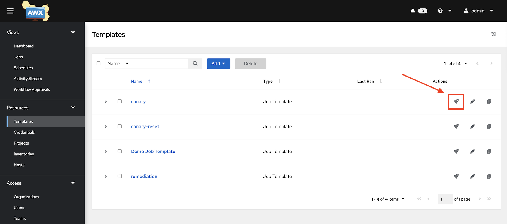
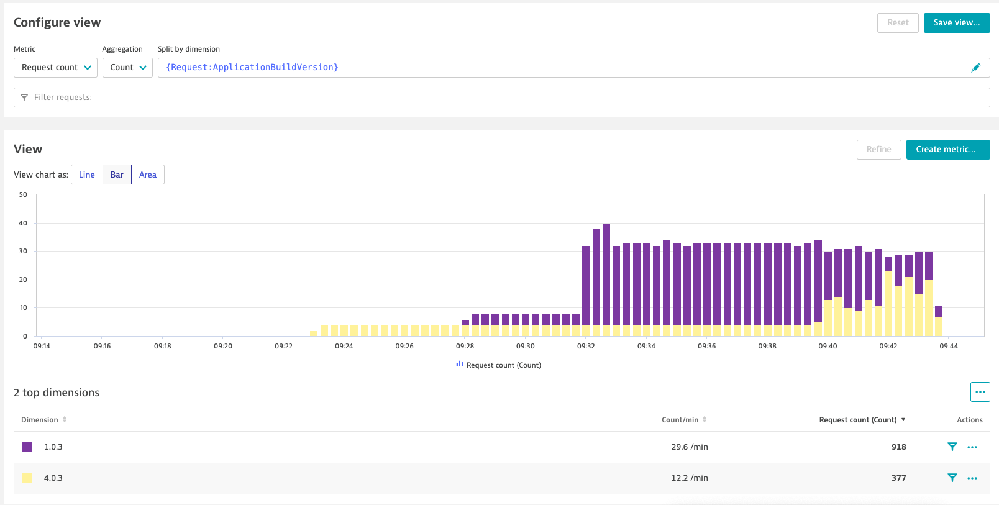

### Use case: Canary + auto remediation

# Shift traffic

At the moment, the load generator is calling the service's ingress. Although both versions (*build 1* and faulty *build 4*) of our service are deployed, 100% of the traffic is routed to *build 1*, the current "live" version. We can now start to shift traffic to the service's canary version (*build 4*).

## 1. Use AWX to route traffic to the canary

1. Go to AWX (see the dashboard for credentials)
2. Under "Templates", launch "canary" with it's default settings

    

A playbook is run which slowly increases the percentage of traffic that is routed to the canary. With each incrementation step an event is pushed to Dynatrace to make it aware of the service's configuration change. When you visit the application in your browser ( `http(s)://simplenodeservice.canary.<ingress domain>` ) the likelyhood of reaching the new service is steadily increasing up to the point where you'll only see the new version.

## 2. Inspect traffic shift in Dynatrace

This shift in traffic can also be inspected in Dynatrace:

1) In your Dynatrace tenant, navigate to **Services** and select management zone "ace-demo-canary". This should filter for a single service "simplenodeservice.canary". If this doesn't work you can manually filter by `Tag:app:simplenodeservice` and `Tag:environment:canary`.
2) Select "simplenodeservice.canary"
3) Click on "Create analysis view" under "Multidimensional analysis views".
4) Select metric "Request count", aggregation "Count" and split by dimension "{Request:ApplicationBuildVersion}"

    Expected view:

    

You can see that the request count for service *build 1* is steadily decreasing while simultaneously increasing for service *build 4*.